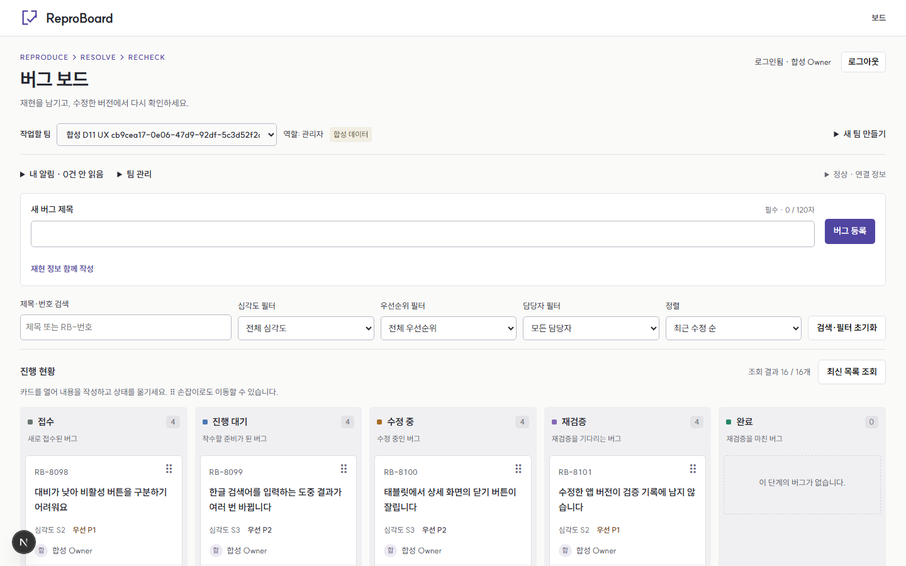

# ReproBoard

**버그의 재현 정보를 모으고, 수정 뒤 다시 확인해 완료하는 소규모 팀 도구.**

`v0.1.0` 릴리스 후보 · [GitHub 비공개 저장소](https://github.com/YouthCorp/reproboard) 연결 완료 · 공개 서비스는 아직 없습니다.

[실행하기](docs/DEVELOPMENT.md) · [실제 시연 영상](docs/DEMO.md) · [기술 사례 3건](docs/CASE_STUDY.md) · [릴리스 메모 초안](docs/RELEASE_NOTES.md)

- **요청별 낙관적 UI**: 한 카드의 저장 실패가 다른 카드의 성공을 되돌리지 않습니다.
- **동시 수정 보호**: DB version 검사로 한 요청만 성공하고, 다른 사용자의 입력은 비교·복사할 수 있습니다.
- **재연결 수렴**: 실시간 이벤트는 재조회 신호로 사용하고, 구독 복구 뒤 최신 서버 상태를 확인합니다.



2026-09-27 실제 앱 화면입니다. 모든 시연 데이터는 합성입니다. [상세 화면](docs/evidence/ui-after/detail-1440.png) · [모바일](docs/evidence/ui-after/board-390.png) · [UI 개선 전후](docs/UI_UX_REVIEW.md)

## 무엇을 할 수 있나요?

제목만으로 **접수**한 뒤 재현 단계·기대 결과·실제 결과·환경을 채웁니다. **진행 대기 → 수정 중 → 재검증 → 완료**로 이동하며, 완료에는 현재 버전에 대한 통과 기록이 필요합니다. 실패와 재오픈 이유도 남습니다. 드래그 없이 이동 메뉴로 같은 작업을 할 수 있습니다.

팀별 관리자·멤버·읽기 전용 권한, 24시간 일회용 초대, 일반 텍스트 댓글·팀 멘션·개인 알림, URL로 공유하는 검색·필터·정렬·상세를 구현했습니다. 재현 정보의 `4개 중 n개`는 입력 충족 수이며 재현 성공률이 아닙니다.

## 빠른 실행

Node **24.19.0**, pnpm **11.19.0**, Linux 컨테이너를 실행하는 Docker가 필요합니다. Supabase CLI는 프로젝트 의존성으로 고정했습니다. 로컬 개발 전용 명령이며 운영 DB에 seed/reset을 실행하지 않습니다.

```text
pnpm install --frozen-lockfile
node scripts/ci-stack.mjs start
pnpm db:migrate
pnpm db:seed
pnpm db:env
pnpm dev
```

[로그인](http://127.0.0.1:3000/login)에서 **합성 Owner → 개발 계정으로 로그인**을 선택합니다. seed는 사용자 4명·팀 2개를 준비하며 비밀번호는 무시된 `.local/dev-accounts.json`에만 저장합니다. 기존 값과 충돌하면 도구가 중단하므로 환경 파일을 임의로 덮어쓰지 마세요.

[전체 설치·Windows/WSL·깨끗한 복사본 재현](docs/DEVELOPMENT.md)에서 버전 확인, 포트, DB 타입 생성과 종료·복귀 절차를 확인할 수 있습니다. DB 없이 실행하면 저장 기능이 없는 미리보기입니다.

### 환경 변수와 인증

[.env.example](.env.example)을 기준으로 `db:env`가 로컬 `.env.local`을 준비합니다. 앱에는 공개 Supabase URL/key와 `NEXT_PUBLIC_SITE_URL`이 필요합니다. `DEV_LOGIN_ENABLED`는 로컬 개발 전용이며 production에서는 개발 로그인이 차단됩니다. 서비스 키·OAuth secret을 브라우저 환경 변수에 넣지 않습니다.

GitHub OAuth 코드는 있지만 실제 공급자 왕복은 **NOT_RUN**입니다. [OAuth 앱·callback 설정](docs/DEVELOPMENT.md) 후 별도 확인해야 합니다. 로컬 시연은 OAuth를 가장하지 않는 실제 개발 사용자 세션입니다.

## 검증

```text
pnpm lint
pnpm typecheck
pnpm test
pnpm test:local-tools
pnpm test:docs
pnpm exec playwright install chromium
pnpm test:integration:db
pnpm test:integration:ui
pnpm build
pnpm test:e2e
```

실행 조건과 데이터 격리는 [개발 안내](docs/DEVELOPMENT.md), 날짜·범위·실패 이력은 [TEST_REPORT](docs/TEST_REPORT.md)에 있습니다. 로컬 단위/UI 57, 격리 DB 46, 격리 E2E 35, production smoke 6건 PASS를 기록했습니다. UI 변경 후 실제 DB UI 35건을 다시 확인했습니다. 이 숫자는 서로 다른 검증 층이며 사용자 수나 품질 개선율이 아닙니다. 첫 원격 CI는 push로 시작했으며 결과는 [TEST_REPORT](docs/TEST_REPORT.md)를 따릅니다. **실제 OAuth·배포 smoke는 NOT_RUN**입니다.

## 구조와 결정

Next.js App Router + TypeScript, TanStack Query, Zustand, Supabase Auth/Postgres/Realtime를 사용합니다. 정확한 버전은 [package.json](package.json)과 [lockfile](pnpm-lock.yaml)에 고정되어 있습니다.

| 경로 | 역할 |
|---|---|
| [src/app](src/app) | 라우트·로그인·콜백·오류 경계 |
| [src/features/issues](src/features/issues) | 보드·폼·전환·요청 overlay·실시간 복구 |
| [src/lib/supabase](src/lib/supabase) | 클라이언트·생성 DB 타입 |
| [supabase/migrations](supabase/migrations) | 권한·명령·상태 규칙·원자성·publication |
| [tests](tests) / [scripts](scripts) | 순수 규칙·실제 DB/E2E·로컬 보호 도구 |

[제품 규칙](docs/PRD.md) · [현재 아키텍처](docs/ARCHITECTURE.md) · [수용 기준](docs/ACCEPTANCE.md) · [설계 결정 3건](docs/DECISIONS.md) · [진행 상태](docs/PROGRESS.md)

## 알려진 한계

초안과 미확정 요청은 새로고침·팀 이탈 후 복원하지 않습니다. 서로 다른 필드도 같은 이슈 version이면 충돌하며 자동 병합하지 않습니다. 오프라인 쓰기 큐, 파일 첨부, 이슈 삭제, 새로운 `/demo` 화면은 없습니다. Chromium/로컬 환경 중심의 자기 검증이며 실제 OS 한글 IME·스크린리더·외부 사용자 관찰·장기 단절 반복은 NOT_RUN입니다. 과거 실시간 콜드스타트 대기 실패 1회의 원인도 미확정입니다.

필수 외부 확인이 남아 정식 릴리스로 표시하지 않습니다. [릴리스 후보의 남은 작업](docs/RELEASE_NOTES.md)을 완료한 뒤 태그·공개 여부를 결정합니다.

## 기여·보안·라이선스

[기여 안내](CONTRIBUTING.md) · [보안 정책과 공개 전 조건](SECURITY.md) · [MIT 원본 라이선스](LICENSE) · [외부 자산·의존성 라이선스](THIRD_PARTY_NOTICES.md)

기존 저작권 표기 `2026 ReproBoard contributors`를 유지합니다. 번들된 SUIT 폰트는 별도의 SIL OFL 1.1입니다. 제품 작성자의 요구·판단과 Codex의 구현·검증 지원 범위는 [CASE_STUDY](docs/CASE_STUDY.md)에 구분했습니다.
