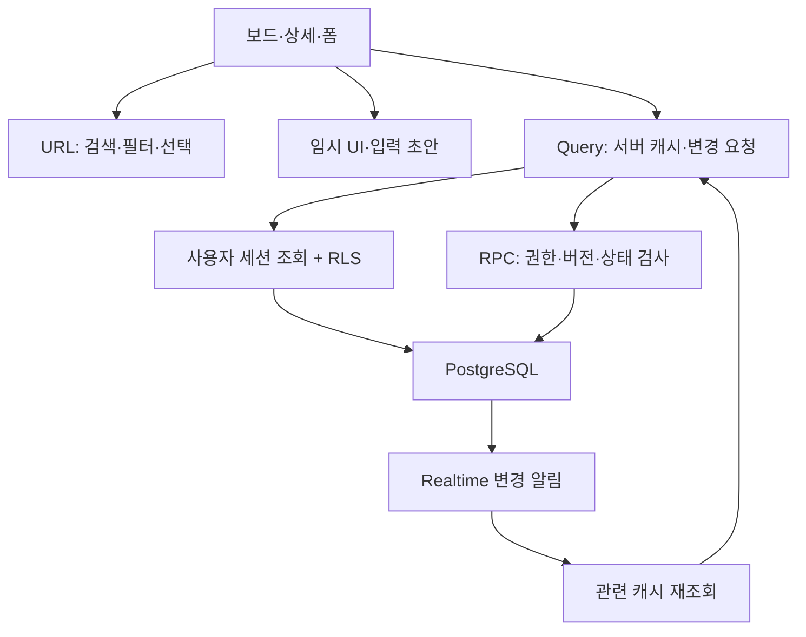

# 기술 계약과 아키텍처

상태: D9 댓글·멘션·인앱 알림과 D8 연결 복구까지 로컬 구현. 아래 단계별 절은 당시 범위를 보존하며 현재 검증 상태는 PROGRESS/TEST_REPORT를 따른다.

## D9 실제 구현과 경계

- `20260923000100_d9_comments_notifications.sql`은 `public.comments`/`public.notifications`와 `add_comment`/`mark_notification_read`를 추가한다. 현재 사용자의 membership을 잠그고 역할을 검사한 뒤 기존 actor/workspace/requestId 잠금·payload 해시·receipt 계약을 적용한다. 재전송에도 현재 권한을 먼저 검사한다. 빈 search_path의 SECURITY DEFINER이며 authenticated에 필요한 EXECUTE만 준다.
- 댓글은 trim 후 Unicode 코드 포인트 1~4,000자, 중복 제거 후 멘션 최대 8명이다. user id별 현재 같은 팀 membership을 검사·잠근다. 자기 멘션은 기록하되 알림은 만들지 않는다. `(recipient_id, comment_id)` UNIQUE와 명령 receipt로 중복 효과를 막는다. body/mention_ids 외 입력과 actor 주입은 거부한다.
- 댓글·comment_added activity·수신자별 알림·성공 receipt는 한 트랜잭션이다. 이슈 본문/version/updated_at은 변경하지 않는다. Done에도 댓글을 쓸 수 있고, 댓글 때문에 기존 본문 초안의 version이 오래된 값이 되지 않는다. 댓글 수정·삭제는 없다.
- 댓글/activity는 같은 팀만 SELECT, 알림은 같은 팀에 남아 있는 수신자 본인만 SELECT/읽음 RPC가 가능하다. Viewer는 댓글 작성 불가·조회/본인 읽음 가능. 직접 DML은 모두 닫는다. 표시 이름은 기존 `list_workspace_members`의 필요한 팀 프로필만 사용한다.
- Query 키는 `['comments', workspaceId, issueId]`, `['activity', workspaceId, issueId]`, `['notifications', workspaceId, userId]`다. 댓글/알림은 200개씩 모든 페이지를 조회하고, 활동 UI는 최근 50건임을 명시한다. 텍스트는 React text child로 렌더링하며 HTML 삽입/링크 자동 변환/편집기는 없다.
- publication에 comments/activity_events/notifications를 추가하고 댓글·활동 INSERT, 알림 INSERT/UPDATE를 기존 workspace 구독에 묶었다. 이벤트 payload를 배열에 넣지 않는다. D8의 구독→조회→dirty 추가 조회, HTTP fallback, workspace/logout 캐시·구독 정리에 새 Query를 포함한다. 필터는 최적화이고 RLS가 권한 경계다.
- 댓글/읽음 명령은 retry=false/networkMode=always이며 전송 전 offline을 차단한다. 미확정 요청은 원래 payload/requestId를 보존해 명시적으로 확인한다. 확정 성공 뒤 재조회 실패는 명령 실패로 바꾸지 않는다. 댓글 초안·미확정 요청은 현재 상세 수명에만 있으며 상세 닫기/팀 이탈/reload 후 복원은 미지원이다.

공식 근거(2026-09-23 확인): [Postgres Changes의 publication·여러 테이블·RLS](https://supabase.com/docs/guides/realtime/postgres-changes), [Database Functions의 SECURITY DEFINER/search_path·EXECUTE 제한](https://supabase.com/docs/guides/database/functions). 설치된 Supabase JS 2.116.0 타입/소스와 대조했으며 의존성 추가·버전 변경은 없다.

## D7 실제 구현과 경계

- `20260921000100_d7_issue_realtime.sql`이 `public.issues`만 `supabase_realtime` publication에 추가한다. 기존 RLS·SELECT grant·RPC-only 쓰기는 변경하지 않는다. receipt·프로필·초대는 publication에 넣지 않으며 DELETE 구독/하드 삭제 기능은 없다.
- `IssueRealtime`은 로그인 사용자/팀의 `IssueCommands` 경계에서 현재 세션의 Supabase client로 INSERT/UPDATE를 구독한다. `workspace_id=eq.<id>`는 조회 범위를 줄이는 필터이며 권한 판단은 서버 RLS다. cleanup은 coordinator를 중지하고 해당 channel을 제거한다.
- 초기 일반 조회는 먼저 화면을 채울 수 있다. `SUBSCRIBED` 뒤에는 이전 진행 중 조회를 `cancelQueries`로 취소하고 관련 Query를 강제 재조회한다. SDK GET에 Query AbortSignal을 연결한다. 구독 전에 시작한 요청을 구독 후의 최신 조회로 재사용하지 않는다.
- `realtime-refresh.ts`는 50ms 병합 대기와 dirty bit를 사용한다. 조회 도중 수신한 이벤트는 다음 조회를 예약하며, 그 조회까지 끝나야 구독 중 안내로 바뀐다. 데이터는 이벤트 payload에서 가져오지 않고 issues/verification-runs/transitions/membership/members Query를 통해 다시 읽는다. 같은 이벤트를 두 번 전달해도 배열 append가 없다.
- D6의 version 병합과 overlay를 그대로 사용한다. 더 높은 서버 version은 pending 표시/잠금을 유지하면서 실제 상태를 표시한다. 늦은 성공·거부가 최신 Query나 다른 카드의 성공을 이전 값으로 복구하지 않는다.
- `ConflictRecovery`는 같은 Query의 서버 값과 폼 로컬 초안을 비교한다. 입력 복사는 명시적 클릭에서만 클립보드에 쓰며 거부 시 선택 가능한 읽기 전용 텍스트를 제공한다. 최신 값으로 다시 편집은 폼과 기준 version만 교체하고 다음 명시적 저장이 새 requestId를 만든다. Done으로 바뀌어도 보존한 초안 복사/비교는 노출한다.
- 충돌 정책은 이슈 단위이며 서로 다른 필드도 충돌한다. 실제 두 browser context의 Owner/Member가 version N으로 보낸 서로 다른 필드 수정은 성공 1·CONFLICT 1이었다. DB의 기존 행 잠금/expectedVersion/원자적 activity·receipt를 사용하며 새 우회 명령을 추가하지 않았다.
- 최초 구독·조회 중 변경, 실제 프레임 중복, 두 사용자 초안·pending·다른 카드·늦은 성공은 D7 검증 범위다. HTTP/WS 구분·폴링·단절 복구·권한 철회/재마운트 전체 행렬·영속 초안/미확정 요청 복원은 D8 이후다. Realtime의 정확히 한 번 전달을 보장하지 않는다.

공식 근거(2026-09-21 확인): [Supabase Postgres Changes와 publication/RLS](https://supabase.com/docs/guides/realtime/postgres-changes), [QueryClient cancel/invalidate](https://tanstack.com/query/latest/docs/framework/react/reference/classes/QueryClient), [Playwright의 실제 WebSocket 프록시](https://playwright.dev/docs/api/class-websocketroute). SDK 2.116.0과 Query 5.102.8의 설치 코드/타입으로 API를 대조했으며 패키지·lockfile 변경은 없다. 구독 후 조회와 dirty bit는 프로젝트의 조정 로직이다.

## D6 실제 구현과 경계

- `@dnd-kit/core@6.3.1`의 PointerSensor(8px 활성화)·고정 5열 droppable을 사용한다. 드래그는 상태 변경이며 같은 열은 no-op, 금지 전환은 요청 없이 안내한다. 열 내부는 서버 updated_at 내림차순/id 오름차순이며 수동 정렬·sortable은 없다. 키보드 대안은 기존 상세 이동 메뉴다.
- `IssueCommands`는 사용자/팀 경계 안에 Zustand vanilla store를 생성한다. store에는 요청 입력·식별자·단계와 안내 문구만 있으며 이슈 배열은 없다. `begin`의 동기 예약으로 같은 이슈 편집/이동 한 건만 허용하며 다른 이슈는 독립적으로 실행한다. 각 UI의 Query mutation은 retry=false/networkMode=always다.
- `displayedStatus`가 Query 행 위에 요청의 target_status만 투영한다. 보드 열과 상세 상태 표시는 같은 규칙을 사용하고 본문/폼 기준은 서버 값이다. 드래그 입력이 필요한 전환은 다이얼로그 제출 전에는 overlay도 DB 요청도 만들지 않는다. 필수 정보 누락은 D5의 순수 규칙과 기존 DB 명령이 검사한다.
- 성공은 `acceptIssue`로 Query 반영 → 해당 요청 제거 → 관련 목록/기록 재조회 순서다. 거부는 해당 요청만 제거하고 최신 조회한다. `mergeIssueSnapshot`은 Query structuralSharing의 실제 캐시 반영 시 각 반환 행의 version을 비교해 진행 중 GET이 더 최신 성공을 덮지 않게 한다. 서버 snapshot에서 사라진 행은 보존하지 않으며 권한 없는 빈 조회를 임의로 채우지 않는다.
- 실제 RPC 전송에 10초 AbortSignal을 적용한다. 타임아웃/SDK 오류는 DB의 거부 응답과 구분해 uncertain으로 남기며 자동 재전송하지 않는다. 카드/입력 창의 명시적 확인은 기존 requestId·expectedVersion·payload를 그대로 사용한다. 더 높은 서버 version을 조회해도 receipt의 확정 결과를 받기 전에는 요청 잠금을 풀지 않는다.
- 요청 수명은 상세/카드 컴포넌트보다 길다. 미확정 입력 창을 닫고 다른 카드를 조작해도 요청과 카드의 재확인 버튼은 남는다. 사용자/팀 경계가 사라지면 store는 폐기하고 늦은 명령 결과로 캐시를 다시 채우지 않는다. reload/팀 이탈 후 미확정 요청 복원은 미지원이며 서버를 다시 읽는다.
- 장애 주입은 `tests/db-ui/optimistic.spec.mjs`의 Playwright route에만 있다. 실제 사용자 RPC를 `route.fetch()`로 완료한 뒤 응답만 abort/보류한다. 앱에는 테스트 지연·강제 성공·거부 스위치가 없고 DB/RPC/migration은 D5 그대로다.

공식 근거: [dnd-kit core 문서](https://dndkit.com/legacy/introduction/getting-started/), [PointerSensor](https://dndkit.com/legacy/api-documentation/sensors/pointer/), [Zustand의 Next.js store 경계](https://zustand.docs.pmnd.rs/learn/guides/nextjs), [Query 낙관적 UI](https://tanstack.com/query/latest/docs/framework/react/guides/optimistic-updates). npm metadata의 core 6.3.1 peer는 React/React DOM ≥16.8, Zustand 5.0.15는 React ≥18·Node ≥12.20이며 설치된 React 19.3.0·Node 24.19.0과 대조했다. core는 공식 문서상 legacy 계열이며 최신 react 계열로 혼용하지 않았다.

## D5 실제 구현과 경계

- migration `20260920000100_d5_issue_transitions.sql`은 상태 CHECK를 5개로 확장하고 상태별 정적 필드 CHECK 및 `public.verification_runs`를 추가한다. 검증 기록은 같은 팀/이슈 복합 FK, 사용자/팀/requestId receipt FK, `(workspace_id, issue_id, issue_version_before)` unique로 묶는다. RLS는 팀 멤버 SELECT만, anon/클라이언트 직접 DML은 거부한다.
- 순수 `state-rules.ts`와 DB `private.issue_state_errors`가 Ready 재현/분류·In Progress 유효 담당자·Verify/Done 수정 메모/빌드 조건을 표현한다. DB helper는 직접 실행을 허용하지 않고 현재 담당자 membership을 잠근 명령에서 호출한다. 기존 `update_issue`도 제안된 필드 전체의 현재 상태 조건을 검증하며 Done의 새 편집은 거부한다.
- `transition_issue(workspace, issue, expectedVersion, requestId, payload)`는 auth.uid 확인 → 요청 advisory lock → Owner·Member membership 잠금/receipt 확인 → 이슈 행 잠금/version 비교 → 8개 전환과 입력/담당자 검사 → 검증 기록/상태/version/activity/receipt 단일 트랜잭션 순서다. public 명령은 빈 search_path SECURITY DEFINER이며 일반 사용자에게 해당 EXECUTE만 추가한다.
- payload는 `{target_status}`, 되돌림/재오픈은 `{target_status, reason}`, Verify 결과는 `{target_status, verification: {tested_build, tested_environment, note?}}`만 받는다. 검증 결과 pass/fail은 이동 방향에서, actor/issue_version_before/시각은 현재 세션·잠근 이슈에서 정한다. 추가 사용자/결과/version 주입과 허용되지 않는 필드는 거부한다.
- 검증한 버전/환경·실패 이유와 돌아간 사유를 별도 기록으로 보존한다. Verify→Done의 pass는 바로 이전 version과 일치하며 같은 요청 중복은 기록을 추가하지 않는다. 오래된 성공 receipt를 다시 받아도 Query를 그 응답으로 덮지 않고 현재 이슈·기록을 재조회한다.
- `transition-menu.tsx`는 저장된 이슈만 이동한다. 편집 초안/미확정 저장이 있으면 이동을 잠그고 이동 입력은 중첩 HTML dialog에서 관리한다. 취소/확정 거부 시 상태 캐시를 바꾸지 않는다. 검증 중 version 변경은 입력을 보존하고 최신 본문 확인과 명시적 재시도를 요구한다. 전송 결과 불명은 같은 requestId로 재확인하며 자동 쓰기 재시도는 없다.
- Done에서는 저장된 본문을 읽기 전용으로 접어 보여주고 검증/상태 이력을 표시한다. 다른 사용자에 의한 Done 전환 때 작성 중이던 폼 초안은 숨겨 보존하며 재오픈 후 명시적으로 최신 값과 비교할 수 있다. `verification-runs`/`transitions` Query는 각각 별도 서버 기록의 소유자이며 이슈 자체는 여전히 보드와 상세가 같은 `issues` Query를 사용한다.
- 기존 D2~D4 migration과 requestId 해시 형식을 유지한다. DnD/낙관적 overlay/Realtime/댓글은 추가하지 않았다. 이후 명령도 동일한 상태 불변 조건을 검사해야 한다.

## D4 실제 구현과 경계

- `20260916000100_d4_issue_fields.sql`은 기존 행에 기본값을 추가하는 migration이다. D2 RPC 서명·권한·receipt 해시 형식을 보존하고 허용 필드만 확장한다. create는 title 필수, update는 비어 있지 않은 부분 payload를 기존 행에 병합한 뒤 전체 필드를 검증한다. 상태·행위자·version 주입은 여전히 금지다.
- 문자열 trim·코드 포인트 길이·enum·간헐 조건 메모를 DB에서 검증한다. 담당자는 같은 workspace의 membership 복합 FK로 묶으며 새 지정 시 역할을 행 잠금 아래 검사한다. Viewer로 강등된 기존 담당자는 보존/해제 가능하나 새로 지정할 수 없다. 화면은 재지정 필요를 표시한다.
- 허용된 편집·activity의 old/new 필드·receipt는 단일 트랜잭션이다. 요청 재전송은 현재 권한을 다시 확인하고 기존 결과를 반환한다. 모든 본문 변경은 이슈 단위 expectedVersion을 사용하므로 다른 필드끼리의 수정도 충돌한다.
- `live-board.tsx`의 `["issues", workspaceId]` Query 결과를 `issue-board.tsx`와 `issue-detail.tsx`에 전달한다. 상세용 별도 이슈 캐시는 없다. 선택은 URL의 workspace/issue UUID이며 로그인 복귀·직접 진입·뒤로가기를 지원한다. 인증 구독은 URL 이동과 분리해 같은 사용자의 캐시를 지우지 않는다.
- 폼은 초기 입력값·기준 version·미확정 명령만 로컬에 보유한다. 서버 재조회는 초안을 덮지 않는다. version 차이는 경고하고 명시적인 최신 값 불러오기로만 교체한다. 조회 실패에도 이전 Query 데이터와 열린 폼을 유지하며 저장 결과 불명 시 입력을 잠그고 같은 requestId로 명시적 재시도한다.
- 기본 HTML dialog의 모달 포커스·Escape와 닫기 버튼을 사용한다. 상세 닫기는 입력 저장이 아니며 저장하지 않은 초안은 폐기된다. 모든 폼 필드에 라벨/설명/오류 연결을 제공하고 첫 오류로 포커스를 이동한다. 조합 중 Enter는 제출하지 않으며 UTF-16 maxLength로 한글·이모지 입력을 자르지 않는다.
- 보드는 고정 5열을 실제 데이터로 분류한다. D4 DB 상태 CHECK는 여전히 Inbox만 허용한다. D5의 상태별 불변 조건이 구현되기 전 임의 상태 편집 경로를 열지 않는다. DnD·Realtime·필터/정렬·전역 임시 UI는 추가하지 않았다.

API 근거: [TanStack Query의 query key와 캐시](https://tanstack.com/query/latest/docs/framework/react/guides/query-keys), [HTML dialog의 모달·포커스·닫기 동작](https://developer.mozilla.org/en-US/docs/Web/HTML/Reference/Elements/dialog). 초안 수명과 상태 구현 순서는 프로젝트 결정이다.

## D3 실제 구현과 경계

- `@supabase/ssr@0.12.7`의 browser/server client, `src/proxy.ts`의 `getClaims()` 검증·쿠키 갱신, `/auth/callback`의 PKCE 교환. 세션 결과·쿠키를 공유 응답 캐시에 넣지 않으며 auth 관련 페이지는 dynamic이다. 실제 외부 GitHub 승인/취소는 앱 등록 전 NOT_RUN.
- GitHub 설정 여부는 서버의 Auth settings 조회로 판단한다. callback의 사용자 제공 오류·code는 표시하지 않는다. 복귀 경로는 `/board`(검증한 workspace/issue UUID만)·`/invite`로 한정한다. 원점은 설정된 SITE_URL이며 전달된 Host/next URL을 신뢰하지 않는다.
- 실제 로그인 사용자의 쿠키는 browser/server가 공유한다. 로그아웃·계정 변경은 Query 캐시·폼을 비우고 갱신 불가 세션은 재로그인을 안내한다. 네트워크 오류와 만료를 구분한다. JWT 전역 즉시 폐기·전체 재연결 복구는 보장하지 않는다.
- migration `20260915000100_d3_auth_workspaces.sql`: `public.profiles(user_id, display_name)`와 `private.workspace_invites` 추가. Auth insert trigger는 이름만 제한 길이로 저장하며 기존 계정은 backfill한다. 메타데이터의 role/workspace_id는 권한에 쓰지 않는다.
- 프로필 읽기는 본인 또는 같은 팀으로 제한한다. `list_workspace_members`는 RLS를 따르는 SECURITY INVOKER이며 표시 이름·user id·역할만 반환한다. membership/profile helper는 auth.uid 기준 SECURITY DEFINER로 재귀를 피하고 내부 변경 함수는 직접 호출 불가다.
- `create_workspace`는 생성자를 Owner로 지정하고 멤버를 같은 트랜잭션에 추가한다. `create_invite`는 현재 Owner만, `accept_invite`는 현재 로그인 사용자만 가능하며 역할 입력을 받지 않는다. `change_member_role`은 현재 Owner가 해당 팀의 Member↔Viewer만 변경하고 expectedRole 경합을 검사한다. Owner 이전·자가 강등·비회원 지정은 거부한다.
- 초대는 브라우저 CSPRNG 32바이트의 hex 원문을 DB 명령에서 SHA-256으로 해시한다. private 테이블·receipt 어디에도 원문을 보존하지 않는다. 만료는 생성 시각+24시간 CHECK, 역할은 Member CHECK, 수락은 행 잠금 후 실제 현재 시각 검사→멤버 insert→소비 표시→receipt까지 원자적이다. 이미 가입한 사용자는 소비·승격하지 않는다.
- 생성/수락/역할 명령도 기존 actor/workspace/requestId 잠금과 receipt를 재사용한다. 동일 요청은 추가 효과 없이 반환하고 다른 payload는 거부한다. 수락 replay도 현재 팀 접근 권한을 다시 확인한다. 초대 결과에는 id/만료만 반환하며 링크 원문은 만든 브라우저가 가진다.
- 초대는 URL fragment에서 탭 sessionStorage로 옮겨 로그인 후 복귀한다. 원문은 HTTP URL/OAuth query에 포함하지 않고 수락 성공 후 제거한다. Query는 서버 목록·멤버를, 각 컴포넌트는 입력·미확정 명령을 소유한다. 팀 선택은 URL이며 Zustand는 미도입이다.
- `workspace_permissions`의 DB 권한표는 read/write/verify/comment/invite/manage_members를 명시한다. D2 이슈 명령의 실제 역할 검사도 일치한다. 검증·댓글 endpoint/테이블은 D5/D9에 추가하며 현재는 해당 쓰기 경로가 없다. capability 조회 통과를 검증·댓글 동작 완료로 간주하지 않는다.

공식 근거: [Next.js SSR](https://supabase.com/docs/guides/auth/server-side/creating-a-client?framework=nextjs), [GitHub/PKCE](https://supabase.com/docs/guides/auth/social-login/auth-github), [SSR 캐시 주의](https://supabase.com/docs/guides/auth/server-side/advanced-guide), [Next dynamic 응답](https://nextjs.org/docs/app/guides/self-hosting). 세부 로컬 OAuth 등록 순서는 README에 모았다.

## D2 당시 구현과 경계 (D3 추가 사항은 위 절 참조)

- migration: `supabase/migrations/20260914000100_d2_issue_commands.sql`. `public.workspaces/workspace_members/issues/activity_events`, `private.command_receipts`. profiles·초대·검증·댓글·알림은 아직 없다.
- `issues`는 UUID, 전역 sequence의 `RB-` 키, 제목, Inbox 고정 CHECK, version=1, 행위자·시간만 가진다. 다른 상태는 DB에서 거부한다. 추후 필드/전환은 별도 migration과 명령 검사로 확장한다.
- 클라이언트는 public 4개 테이블의 SELECT와 `create_issue`/`update_issue` EXECUTE만 갖는다. 직접 DML·sequence·receipt·내부 명령 함수 접근은 닫았다. 읽기 helper는 현재 `auth.uid()`만 사용해 membership RLS 재귀를 피한다.
- RPC 인수는 `p_workspace_id`, `p_request_id`, `p_payload: {title}`이고 update만 `p_issue_id`, `p_expected_version`을 추가한다. 추가 payload 필드·잘못된 형식은 VALIDATION이다. 같은 requestId의 payload 비교는 operation·issueId·expectedVersion·원본 JSONB의 SHA-256 기준이다.
- private 공통 명령은 빈 search_path의 SECURITY DEFINER다. 모든 경로에서 auth.uid·현재 멤버십/Owner·Member 역할을 검사한다. 팀 외 이슈와 없는 이슈는 NOT_FOUND로 동일하게 응답한다. Viewer/비회원의 쓰기는 FORBIDDEN이다. public wrapper는 operation을 고정하며 내부 함수 직접 EXECUTE는 허용하지 않는다.
- 잠금 순서: 사용자/팀/requestId의 transaction advisory lock → 멤버 행 FOR SHARE → receipt 확인 → 생성 시 팀 행 FOR UPDATE, 수정 시 이슈 행 FOR UPDATE. 성공한 이슈·activity·receipt는 한 트랜잭션에 저장한다. receipt를 읽는 재전송도 현재 권한을 다시 검사한다. 요청 실패·예외 시 성공 receipt는 남지 않는다.
- 생성은 팀 잠금 안에서 500개 한도를 확인한다. 수정은 잠근 행의 version과 비교한다. 같은 requestId는 기존 성공 결과를 반환하므로 새 version/행을 만들지 않는다. 오래된 receipt 응답으로 Query 캐시를 덮지 않고 다시 조회한다.
- UI: `features/auth/board-session.tsx`, `features/issues/live-board.tsx`, `issue-form.tsx`. 이슈는 Query에만 저장한다. 팀은 URL, 제목 초안은 각 폼에 둔다. 충돌 때 초안·기준 version을 유지하고 명시적으로 최신 제목을 가져온 뒤 다시 제출한다. 낙관적 이동/Realtime/오프라인 복구 전체 기능은 아직 없다.
- `scripts/local-stack.mjs`가 고정 loopback API/DB·컨테이너 프로젝트와 작업 경로를 검증한다. `db:migrate/types/env/reset/seed`, 실제 DB 테스트가 이 검사를 통과해야 한다. 일반 API는 사용자 세션이며 Auth admin 권한은 합성 seed 도구에서만 사용한다.
- 개발 계정 자격 정보는 gitignore된 `.local`에 생성한다. 서버의 development·명시적 스위치·loopback 검사 후에만 개발 로그인 UI에 전달한다. production 자격 정보 제공, 공개 개발 로그인, hosted seed/reset은 지원하지 않는다.

공식 API 확인: [Supabase 함수 보안/EXECUTE](https://supabase.com/docs/guides/database/functions), [RLS](https://supabase.com/docs/guides/database/postgres/row-level-security), [password 세션](https://supabase.com/docs/reference/javascript/auth-signinwithpassword), [PostgreSQL 행/트랜잭션 잠금](https://www.postgresql.org/docs/17/explicit-locking.html). 위 잠금·receipt 정책은 이 프로젝트의 구현 선택이다.

## 1. 경계

Next.js 서버 측은 앱 진입·인증 콜백·세션 경계를 맡는다. 상호작용하는 보드는 클라이언트 컴포넌트다. DB 조회와 RPC는 사용자 세션으로 Supabase에 요청한다. 별도 REST 서버와 WebSocket 서버를 만들지 않는다. 쿼리 캐시가 담당하는 동일 데이터를 서버 액션과 다른 캐시에 중복 저장하지 않는다.



Realtime는 변경을 알려주는 경로다. 요청 성공의 기준은 트랜잭션 결과다. 이벤트만 보고 DB 저장 성공을 추측하지 않는다.

## 2. 상태 소유권

| 상태 | 소유자 | 규칙 |
|---|---|---|
| 이슈·멤버·댓글·활동·알림 | TanStack Query | Zustand·localStorage에 배열 복제 금지 |
| 검색·필터·정렬·선택 이슈 | URL | 재진입 시 URL에서 복원, 잘못된 값 정규화 |
| 상세 폼 초안 | 폼 컴포넌트 또는 이슈별 임시 draft store | 원격 변경이 있어도 작성 중 입력 덮어쓰기 금지 |
| 드래그 대상·공유 패널 상태 | Zustand | 실제 공유 필요가 없으면 컴포넌트 state 사용 |
| 요청 중 낙관적 이동 | Query mutation 상태/별도 임시 overlay | 서버 캐시와 구분, 해당 요청에만 적용 |
| 연결 상태 | Realtime 어댑터/hook | UI에 동기화 상태와 실제 오류 구분 |

이슈 서버 목록은 `['issues', workspaceId]` 한 캐시를 기준으로 파생 필터링한다. 상세 폼·보드가 같은 데이터를 다르게 복제하지 않게 한다. 댓글·활동은 이슈별, 알림은 사용자별 키를 사용한다. 500개 초과는 명시적으로 제한을 알리고 조용히 잘라서 전체처럼 표시하지 않는다.

## 3. 최소 데이터 모델

| 테이블/영역 | 핵심 필드·제약 |
|---|---|
| profiles | user_id, display_name. 이메일·로그인 공급자 정보는 일반 팀 조회에 불필요 |
| workspaces | id, name, owner_id, created_at |
| workspace_members | workspace_id, user_id, role. 두 id 조합 unique |
| workspace_invites | workspace_id, token_hash, expires_at, accepted_by, accepted_at. Owner 생성, 단일 사용 |
| issues | id, workspace_id, issue_key, PRD 필드, version, created_by, updated_by, timestamps |
| verification_runs | id, issue_id, workspace_id, result, tested_build/environment, note, actor, issue_version_before |
| comments | id, issue_id, workspace_id, body, author_id, mention_user_ids, created_at |
| activity_events | id, workspace_id, issue_id, actor, event_type, old/new 변경 요약, created_at |
| notifications | id, workspace_id, recipient_id, comment_id, read_at. (recipient_id, comment_id) unique |
| private.command_receipts | actor_id, workspace_id, request_id, payload_hash, result. 조합 unique, 일반 읽기 미노출 |

다른 팀의 issue·사용자 id를 payload에 넣어 연결하지 못하게 검사한다. 필요한 복합 FK·unique와 DB 명령 검증을 함께 사용한다. issue key는 경합 없는 sequence/identity 등으로 만들고 삭제 시 재사용하지 않는다.

## 4. 명령과 일관성

변경은 명확한 RPC 단위로 제한한다. 예: create_workspace, create_invite, accept_invite, change_member_role, create_issue, update_issue, transition_issue, add_comment, mark_notification_read. 최종 함수명은 구현 후 문서와 맞춘다.

이슈 변경 입력의 공통 형식:

```ts
type IssueCommand = {
  workspaceId: string;
  issueId: string;
  expectedVersion: number;
  requestId: string;
  // 명령별 허용 필드만 포함
};

type CommandResult<T> =
  | { ok: true; data: T; requestId: string }
  | { ok: false; code:
      'CONFLICT' | 'FORBIDDEN' | 'VALIDATION' | 'NOT_FOUND';
      message: string };
```

실제 Supabase SDK 오류와 위 도메인 결과를 어댑터에서 구분한다. `CONFLICT`는 논리 오류 코드이며 직접 RPC가 자동으로 HTTP 409를 반환한다고 가정하지 않는다. `UNKNOWN_RESULT`·연결 오류는 클라이언트의 전송 상태다.

### 버전 검사

트랜잭션 안에서 현재 사용자의 팀·권한을 검사하고, 대상 이슈를 잠그거나 `WHERE version = expectedVersion` 조건을 사용하는 방식으로 경쟁을 제어한다. 제품 조건을 검사한 뒤 수정·version 증가·활동 기록·필요한 검증 기록을 원자적으로 처리한다. 하나라도 실패하면 모두 반영되지 않는다.

예: 두 사용자가 version 7을 수정하면 한 요청만 8로 성공한다. 나머지는 CONFLICT이며 다른 사용자의 값을 조용히 덮어쓰지 않는다. 다른 필드 변경도 같은 이슈면 충돌하는 단순 정책이다. 자동 필드 병합은 하지 않는다.

댓글 추가는 이슈 필드 version을 증가시키지 않는다. 댓글은 별도 append 명령이고, 활동·알림을 같은 트랜잭션으로 만든다. 재검증 명령은 검사한 이슈 version과 결과를 함께 기록한다. Done 여부와 검증 레코드가 서로 다른 요청에서 따로 저장되면 안 된다.

### 요청 재전송

모든 비가역적인 append/생성 명령과 상태 변경에 requestId를 부여한다. 동일 사용자·팀·requestId·payload 재전송은 기존 성공 결과를 반환하고 추가 행을 만들지 않는다. 같은 requestId로 다른 payload를 보내면 거부한다. 요청의 receipt 생성과 실제 효과는 한 트랜잭션이며 동시 중복 요청도 DB에서 직렬화한다.

receipt를 먼저 클라이언트에서 확인한 뒤 별도 insert하는 구현은 경쟁에 취약하므로 금지한다. 단순 재조회로 결과를 알아보기 어려운 생성·댓글·검증에도 이 계약을 적용한다. receipt를 MVP 기간에는 보존하며 정리 정책은 후속 과제로 명시한다.

## 5. 낙관적 이동

**서버 캐시 원본 + 요청별 임시 이동 overlay** 방식을 기본으로 한다. TanStack Query의 mutation 상태를 이용해 화면용 목록을 만든다. 명시적인 서버 응답 전에는 “저장 중”을 표시한다.

1. 전환에 필요한 입력과 클라이언트 조건을 확인한다.
2. 해당 이슈에 로컬 pending 요청이 없을 때 requestId·expectedVersion·targetStatus를 만든다.
3. 화면에서만 새 열에 보이게 하고 요청을 전송한다. 같은 이슈의 추가 이동은 완료까지 비활성화한다. 다른 이슈는 이동 가능하다.
4. 성공하면 반환된 최신 이슈를 캐시에 반영한 뒤 해당 overlay를 제거한다.
5. 명확한 거부면 overlay만 제거한다. 최신 서버 캐시를 표시하므로 다른 카드의 변경이 취소되지 않는다.
6. 응답 유실이면 성공/실패 미확정 상태를 표시한다. 같은 requestId로 재확인·재시도하고 두 번째 효과를 만들지 않는다.

화면 전체 이전 스냅샷으로 돌리는 롤백은 다른 사용자의 변경을 지울 수 있으므로 사용하지 않는다. 이벤트/성공 응답/진행 중 조회의 순서가 바뀌어도 이슈별 더 낮은 version으로 되돌아가지 않는 병합 규칙을 둔다. 원격 변경으로 초안의 baseVersion이 낡아지면 경고하고 입력은 유지한다.

충돌 UI는 최신 값 보기·내 입력 복사/비교·다시 편집을 제공한다. 새 서버 버전을 읽었다는 이유만으로 기존 초안을 최신 version으로 자동 재전송하지 않는다. 사용자가 확인해 다시 제출하면 새 requestId와 최신 expectedVersion을 쓴다.

## 6. 실시간·재연결

- 사용자에게 허용된 이슈·댓글·활동·본인 알림 테이블의 Postgres Changes를 구독한다. publication 설정을 migration에 포함한다.
- 수신 이벤트는 관련 query invalidation의 계기다. 중복 이벤트로 댓글·알림을 배열에 계속 append하지 않는다.
- 짧은 debounce로 재조회 폭주를 줄이고, 요청별 overlay와 진행 중 폼 입력은 유지한다.
- 최초 진입과 재연결은 **구독 완료 후 최신 조회**, 그 사이 수신한 변경은 dirty 표시 후 추가 조회한다. 끊긴 동안의 이벤트가 모두 재전송된다고 가정하지 않는다.
- logout/workspace 전환 때 구독·캐시·임시 입력을 정리한다. Strict Mode와 재마운트에서 구독이 중복되지 않는다.
- `navigator.onLine`은 힌트일 뿐이다. HTTP와 Realtime 상태를 따로 관찰한다.
- 브라우저 오프라인이나 HTTP 오류 시 변경 요청을 쌓아두지 않는다. 읽은 데이터는 오래된 값임을 표시하고 폼 입력은 유지한다.
- mutation의 라이브러리 기본 pause/resume가 오프라인 큐처럼 작동하지 않게 설정한다. 저장 요청은 명시적 연결 확인과 networkMode/retry 정책으로 관리하고 이를 테스트한다.
- WebSocket만 실패하고 HTTP가 정상이면 “실시간 연결 불안정” 표시, HTTP 저장 허용, 임시 조회 폴링(예: 15초)과 재구독을 사용한다. 백그라운드·logout 때 정리한다.
- 재연결 후 최신 조회 완료 전에는 “동기화 중”을 표시한다. 재구독 성공만으로 “최신”이라고 표시하지 않는다.
- 권한 변경은 서버에서 즉시 검사한다. 멤버십 재검사·window focus·읽기/쓰기 거부 시 캐시 제거를 처리한다. 권한 철회 이벤트가 모든 상황에서 즉시 전달된다고 주장하지 않는다.

실시간 전파의 정확히 한 번 전달, 완전한 오프라인 지원, 운영 규모 확장성을 보장한다고 쓰지 않는다.

D8 구현: `WorkspaceConnection`이 팀 수명의 채널·50ms dirty coordinator·foreground 15초 복구/멤버십 조회를 소유한다. SDK가 WS 재연결을 맡으며 같은 채널을 별도 타이머로 중복 생성하지 않는다. 브라우저 offline 후에는 채널을 제거하고 online 때 새로 구독한다. Query와 mutation은 `networkMode: always`, `retry: false`로 숨은 pause/resume를 막고 명령의 전송 전 offline 검사 및 명시적 재확인을 사용한다. HTTP는 10초 제한이며 시간 초과는 명령 거부 증거가 아니다. 캐시 제거 전에 쿼리를 취소하고 실제 unmount의 늦은 명령은 캐시에 쓰지 않는다. Viewer 강등 후에는 허용된 읽기 캐시는 유지하고 기존 초안을 읽기 전용으로 보존한다. 멤버십 소실/팀 이탈/세션 종료는 해당 캐시·초안·요청을 제거한다. 세션 검사는 focus/online/REST 401 및 60초 간격의 실제 Auth 응답을 사용하며, 통신 오류만으로 로그아웃하지 않는다. JWT의 즉시 전역 무효화를 보장하지 않는다.

## 7. 권한 구현

읽기는 노출된 모든 테이블의 RLS와 필요한 grant로 제한한다. 클라이언트의 직접 insert/update/delete는 기본적으로 닫고 검증된 RPC에만 변경 권한을 부여한다. RPC가 SECURITY DEFINER이면 RLS 우회 가능성을 고려해 auth.uid, 실제 멤버십, 역할, 리소스 소속을 **함수 내부에서 매번** 확인한다.

SECURITY DEFINER는 필요한 함수에만 사용하고 고정/빈 search_path, 스키마로 한정한 테이블 이름, 제한된 execute 권한을 적용한다. 멤버십 정책의 자기 참조 재귀를 피하는 helper도 입력된 user id를 신뢰하지 않고 현재 사용자 기준으로 작성한다. 숨겨진 함수도 인증을 우회하는 경로가 되어서는 안 된다.

프로필은 같은 팀 사용자에게 필요한 표시 이름만 노출한다. 알림은 본인의 소속 팀 알림만 조회·읽음 처리 가능하다. 새 팀 생성·초대 수락 같은 bootstrap RPC도 역할을 클라이언트에서 받지 않는다. 비회원에게 존재 여부가 새지 않게 not found/forbidden 응답을 정규화한다.

service/secret 키는 브라우저·앱의 일반 요청에 사용하지 않는다. 로컬 계정 seed처럼 명확히 개발 도구인 작업에만 제한한다. E2E의 일반 작업은 각 사용자의 실제 세션으로 실행한다.

## 8. 로컬 실행과 데모

기본은 Node 지원 LTS + 패키지 매니저 1종 + Supabase CLI/Docker. Windows면 현재 셸과 Docker Desktop/WSL2 상태를 먼저 조사한다. 문서 작성 시 버전·명령 성공을 미리 가정하지 않는다.

setup script는 migration, 로컬 개발 사용자 Owner/Member/Viewer, 별도 워크스페이스 사용자, 합성 seed를 만든다. 개발 로그인 UI/자격 정보는 development 모드에만 제공한다. GitHub OAuth는 실제 공급자 설정으로 별도 수동 smoke 검증한다. OAuth 화면 자체를 CI에서 매번 자동 조작하지 않는다.

DB reset/seed는 loopback의 개발 DB임을 확인하는 보호 조건을 갖는다. 공유·운영 주소라면 중단한다. 생성한 .env.local과 storageState는 gitignore. .env.example에는 값 없는 키 이름과 용도만 둔다.

공개 데모는 fixture 전용 읽기 화면으로 제공할 수 있다. 실제 협업은 로그인된 별도 팀 또는 영상으로 보여준다. 공유 관리자 계정·전역 RLS 해제로 데모 접근을 해결하지 않는다.

## 9. 테스트 경계

- 순수 규칙: 상태 전환 표, 필수 정보 계산, URL 파서, version 비교·overlay 파생.
- UI 통합: 폼 오류, 충돌 초안, 이동 실패, 포커스, 실제로 의미 있는 접근성 흐름.
- DB/API: 현재 사용자별 읽기·쓰기, 타 팀 주입, version 경합, idempotency, 초대 경합, 원자적 로그.
- Playwright 실제 백엔드: 서로 다른 browser context 로그인, 상태 반영·충돌·재연결.
- 장애 주입: 요청 전 거부와 DB commit 후 응답 유실을 별도 시나리오로 구성. 테스트 전용 네트워크 프록시/래퍼는 production에 노출하지 않음.

목표 테스트 수나 100% 커버리지보다 ACCEPTANCE의 실제 위험을 검증한다. 컴포넌트 테스트의 mock 결과를 실제 DB·실시간 검증으로 설명하지 않는다.

## 10. 참고

[TanStack 낙관적 UI](https://tanstack.com/query/latest/docs/framework/react/guides/optimistic-updates), [Supabase 변경 구독](https://supabase.com/docs/guides/realtime/postgres-changes), [Supabase RLS](https://supabase.com/docs/guides/database/postgres/row-level-security), [PostgreSQL 격리](https://www.postgresql.org/docs/current/transaction-iso.html), [Playwright 사용자 격리](https://playwright.dev/docs/browser-contexts). 이 문서의 overlay·명령 계약·재연결 전략은 본 프로젝트의 설계 선택이며 그대로 제공되는 단일 SDK 기능이 아니다.
