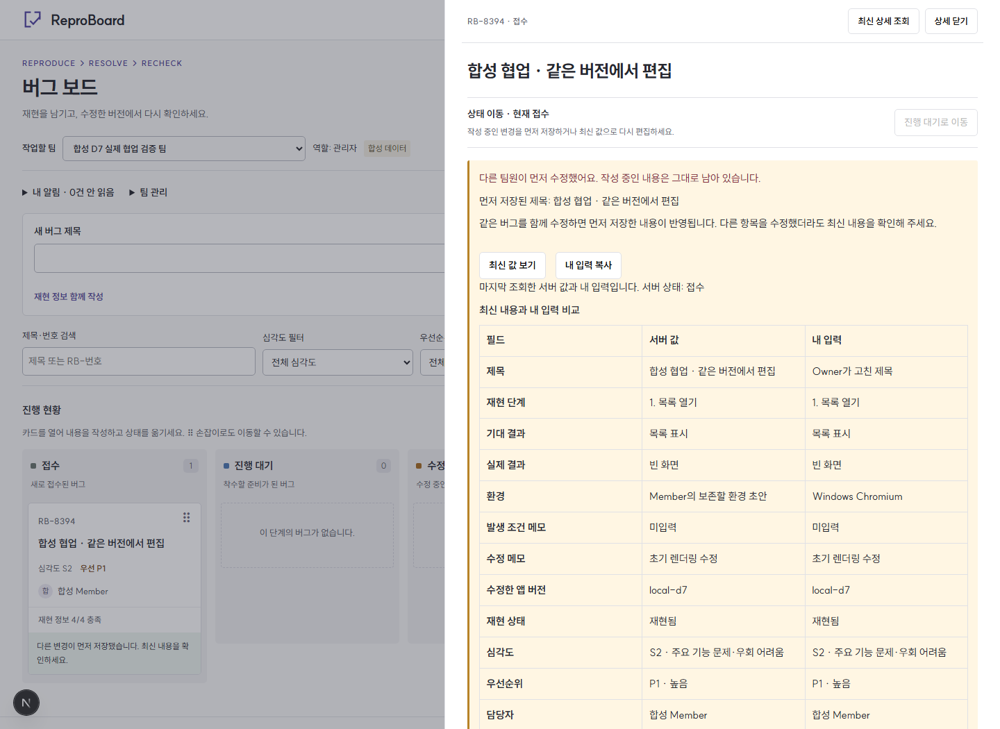

# 기술 사례 연구

ReproBoard는 소규모 팀이 버그를 접수하고 재현 정보를 갖춘 뒤 수정·재검증하는 도구다. 제목만으로 시작할 수 있지만 완료에는 현재 버전에 대한 검증 기록이 필요하다. 구현 범위와 한계는 [제품 계약](PRD.md), 현재 결과는 [검증 보고서](TEST_REPORT.md)에 공개한다. 상태는 **v0.1.0 릴리스 후보**다.

## 작업 범위와 역할

- **작성자(프로젝트 기획자)**: 제품 목적·단계별 요구사항·권한/상태 규칙·검증 기준을 제시했다. 현재 화면에 대해 정보 위계, 한국어, 제품 정체성 문제를 지적하고 개선 방향을 요청했다. 작성자가 모든 코드를 직접 작성하거나 모든 테스트를 직접 수행했다고 주장하지 않는다.
- **Codex**: 저장소 조사, 구현·수정, 로컬 명령과 브라우저 검증, 캡처·녹화, 기술 대안 정리와 문서 초안을 수행했다. 아래 실험은 이 작업 환경에서 수행한 자기 검증이며 독립 사용자 연구가 아니다.
- **확인 범위**: 2026년 9월 진행 기록. 14일·70시간은 계획 예산이고 실제 투입 시간은 집계하지 않았다. 실제 서비스 사용자 수·버그 감소·생산성 개선율은 측정하지 않았다. 화면과 영상의 사용자·버그는 모두 합성 데이터다.

## 1. 한 카드의 실패가 다른 카드의 성공을 지우지 않게 하기

**문제.** 카드 A를 옮기는 동안 B를 처리하거나 다른 팀원이 수정할 수 있다. A 저장 실패 때 보드 전체를 이전 배열로 되돌리면 그 사이 성공한 변경까지 사라진다. 응답이 없을 때 DB 저장도 실패했다고 단정하는 것 역시 위험하다.

**대안.** 전체 snapshot 복원은 구현이 단순하지만 동시 변경에 취약하다. 캐시의 카드별 역연산은 변경 순서와 겹치는 요청을 추적해야 한다. 서버 스냅샷과 요청별 임시 표시를 분리하면 실패 범위를 요청 하나로 제한할 수 있다.

**선택.** TanStack Query가 서버 이슈를 소유하고 Zustand에는 requestId·expectedVersion·payload·pending/uncertain만 둔다. 임시 이동은 그 요청에만 적용한다. 같은 이슈는 하나의 명령만 예약하고 다른 카드는 병렬 조작한다. 성공 값을 version 비교로 반영한 다음 overlay를 지운다. 명확한 거부는 해당 overlay만 제거한다. 10초 타임아웃/응답 유실에는 결과 확인 중을 표시하고 같은 requestId로 확인한다. DB는 실제 변경·활동·receipt를 한 트랜잭션으로 기록한다.

**검증.** [실제 DB UI 테스트](../tests/db-ui/optimistic.spec.mjs)에서 A 요청 보류 → B 성공 → 다른 사용자 A 수정 → A의 실제 CONFLICT를 재현했다. A만 복구되고 B와 다른 사용자의 제목은 유지됐다. Verify→Done의 DB commit 이후 응답만 유실시킨 뒤 같은 요청으로 확인했을 때 검증·activity·receipt가 각 1건이었다. 더 높은 version의 GET 뒤 도착한 낮은 성공 응답도 캐시를 되돌리지 않았다. D12 격리 회귀와 09-27 UI 회귀에서 이 흐름이 PASS였다.

[실패 격리 영상](evidence/d13-request-isolation.webm) · [응답 유실 확인 영상](evidence/d6-receipt-recovery.webm) · [현재 UI의 실패 화면](evidence/ui-states/isolated-failure.png) · [ADR 01](DECISIONS.md#adr-01--낙관적-이동을-서버-값과-분리)

**한계.** 명령 상태는 현재 사용자/팀의 메모리에만 남는다. 새로고침·팀 이탈·로그아웃 후 미확정 요청을 복원하지 않는다. 낙관적 표시는 저장 보장이 아니며 사용자가 최종 결과를 확인해야 한다. 이 사례는 조작 시간 단축률을 측정한 결과가 아니다.

## 2. 서로 다른 필드도 같은 이슈라면 충돌을 알리기

**문제.** 두 사용자가 version N을 열고 각각 제목과 환경을 수정할 수 있다. 마지막 저장 우선이면 상대 변경을 조용히 잃을 수 있고, 수정 내용이 바뀐 뒤 오래된 재검증을 통과 처리하면 완료의 의미도 깨진다.

**대안.** 마지막 저장 우선은 손실을 감지하지 못한다. 편집 잠금은 사용자 이탈/만료 처리가 필요하다. 필드별 병합·CRDT는 자동 병합 경계와 상태 필수 조건이 복잡해진다. 이슈 단위 정수 version 검사는 보수적이지만 거부 이유가 명확하다.

**선택.** RPC가 이슈 행을 잠근 뒤 expectedVersion과 현재 version을 비교한다. 같은 version에서 한 명만 성공한다. 폼의 초안과 기준 version은 서버 재조회와 분리한다. 실패한 사용자에게 최신 내용 비교·내 입력 복사·최신 값으로 다시 편집을 제공한다. 다시 편집은 명시적 선택으로만 폼을 바꾸고 자동 재전송하지 않는다. 재검증 통과 기록과 Verify→Done도 같은 version/트랜잭션에 묶는다.

**검증.** [두 사용자 테스트](../tests/db-ui/realtime.spec.mjs)는 서로 다른 Owner/Member browser context의 실제 로그인 세션을 사용한다. 두 요청을 같은 시점에 풀어 성공 1·CONFLICT 1, version +1, 두 requestId에 대응하는 활동/receipt 합계 1건을 확인했다. 패자의 초안 보존·복사와 명시적 재편집 뒤 상대 필드 유지도 검사했다. [DB 전환 테스트](../tests/db)는 오래된 version의 검증·필수 정보 제거·Done 직접 편집을 거부하는지 확인했다. 서비스 키로 사용자 저장을 대신하지 않았다.

[같은 실행의 Owner 영상](evidence/d13-owner.webm) · [Member 영상](evidence/d13-member.webm) · [ADR 02](DECISIONS.md#adr-02--이슈-단위-version-충돌)

**한계.** 서로 다른 필드여도 충돌하므로 사용자의 비교 작업이 필요하다. 상세 닫기·reload 후 초안 복원은 없다. 댓글은 별도 append 명령으로 본문 version을 올리지 않지만, 본문 자체의 필드 병합은 지원하지 않는다. 실제 팀에서 충돌이 얼마나 잦은지는 측정하지 않았다.

## 3. 연결 표시와 저장 결과를 분리하고 서버 값으로 복구하기

**문제.** 브라우저가 online이거나 WebSocket이 연결됐다고 HTTP 저장 성공을 보장할 수 없다. 연결이 끊긴 동안 이벤트를 놓치고, 복구 GET 중에도 다른 사용자가 수정할 수 있다.

**대안.** 이벤트를 직접 적용하면 유실·중복·순서 역전을 처리해야 한다. 재생 가능한 이벤트 로그는 서버/클라이언트 모두 추가 설계가 필요하다. 변경 알림 뒤 최신 스냅샷을 읽으면 비용은 늘지만 서버를 기준으로 수렴하기 쉽다.

**선택.** 실제 Postgres Changes는 관련 Query를 다시 읽는 신호다. 구독 완료 → 이전 조회 취소 → 멤버십/최신 조회 → 그 사이 dirty 변경의 추가 조회 순서로 복구한다. HTTP와 WS 상태를 분리하고 WS만 실패하면 HTTP 저장과 15초 임시 폴링을 허용한다. 라이브러리의 자동 paused mutation 재개를 막고 오프라인 쓰기를 큐에 쌓지 않는다. 초안은 유지하며 미확정 명령은 같은 requestId로 확인한다.

**검증.** [복구 테스트](../tests/db-ui/recovery.spec.mjs)는 A 단절 → B 저장 → A 복귀 GET 보류 → B 추가 변경 → dirty 재조회 후 최신 값 반영을 실제 세션으로 확인했다. A 초안은 유지됐고 사용자가 저장하기 전 자동 생성 요청은 0건이었다. HTTP만/WS만 실패, 로그인 만료, 강등/멤버십 소실, 팀 전환·로그아웃 뒤 이전 팀 조회 정리도 검사했다. 실제 WS 프레임 중복 전달에서도 카드·댓글을 배열에 누적하지 않았다.

[복구 영상](evidence/d13-offline-recovery.webm) · [부분 장애 영상](evidence/d8-partial-failures.webm) · [현재 UI 복구 후 초안](evidence/ui-states/recovered-draft.png) · [ADR 03](DECISIONS.md#adr-03--변경-알림과-재조회로-복구)

**한계.** 이벤트 재생 대신 재조회 비용과 잠깐의 동기화 대기를 감수한다. DB 권한은 즉시 적용되지만 UI 권한 반영은 재검사 주기에 영향을 받는다. 장기 단절·운영 부하·전파 지연 20회 측정은 NOT_RUN이다. D9 최초 콜드스타트 이벤트 대기 실패 1회는 이후 회귀에서 재현되지 않았으나 원인을 확정하지 못했다.

## 화면과 증거를 읽는 방법

2026-09-27 [UI 개선](UI_UX_REVIEW.md)은 보드를 단계별 작업 공간으로, 상세를 재현→분류/담당→수정/확인 순서의 문서로 정리했다. 실패·미확정·충돌 안내는 복구 행동과 함께 놓았다. SUIT 한 파일, 읽기 폭·줄간격, 자연스러운 한글 상태명으로 위계를 만들었다. 상태 enum·권한·전환 조건을 바꾸지 않았다.

1440/768/390px에서 같은 합성 데이터의 개선 전후를 비교했고 실제 DB UI 35건을 다시 실행했다. D6~D13 영상은 **이전 UI의 기술 동작 증거**다. 위 현재 UI 캡처와 같은 디자인이라고 소개하지 않는다. 외부 사용자 관찰·생산성 개선 측정은 하지 않았다.

---

## 포트폴리오 2페이지 설명 초안

### 1페이지 — 완료의 기준이 있는 버그 보드

**ReproBoard | 버그를 모으는 데서 끝내지 않고 수정 뒤 다시 확인하는 팀 도구**

작은 개발팀은 버그 제목만 공유한 채 재현 방법이나 확인 환경을 빠뜨릴 수 있다. ReproBoard는 제목만으로 빠르게 접수하되, 다음 상태로 이동할 때 필요한 정보를 명확하게 보여주도록 설계했다. 재현 단계·기대/실제 결과·환경을 갖추고 담당자를 정한 뒤 수정한다. 완료는 수정 메모만으로 끝내지 않고, 현재 버전에 대한 재검증 통과 기록과 함께 처리한다.

[대표 보드](evidence/ui-after/board-1440.png)와 [상세](evidence/ui-after/detail-1440.png)를 배치한다. 보드에서는 제목·분류·담당자와 재현 정보 누락을 구분하고, 상세에서는 문제→재현→처리→확인 순서로 읽는다. 상태 이동 메뉴는 드래그의 키보드 대안이다. 모바일은 세로 목록과 전체 화면 상세를 사용한다.

나는 목적·제품 규칙·검증 기준을 정하고 화면의 정보 위계와 한국어 개선 방향을 제시했다. Codex를 저장소 조사·구현·검증·문서화에 활용했다. 실제 실행 기록과 캡처를 근거로 공개 범위를 정리했으며, 이 결과를 독립 사용자 조사나 직접 작성한 코드만의 성과로 소개하지 않는다.

### 2페이지 — 동시 작업에서도 믿을 수 있는 상태

**핵심 결정은 세 가지다.** 첫째, 서버 캐시와 요청별 임시 표시를 분리해 한 카드의 실패가 다른 카드의 성공을 되돌리지 않도록 했다. 둘째, DB version 검사로 동시 수정의 손실을 감지하고 최신 내용 비교·입력 복사·명시적 재편집을 제공했다. 셋째, 실시간 이벤트를 정답으로 쌓지 않고 재조회 신호로 사용해 단절 이후 최신 서버 상태로 복구했다.

순수 규칙/UI 57건, 격리된 실제 DB 46건, 실제 사용자 세션의 격리 E2E 35건과 production smoke 6건의 로컬 PASS 기록이 있다. UI 개선 뒤에도 실제 DB UI 35건을 다시 확인했다. [실패 격리](evidence/d13-request-isolation.webm), [두 사용자 충돌](evidence/d13-owner.webm), [연결 복구](evidence/d13-offline-recovery.webm) 영상은 기술 동작의 근거이며 UI 개선 전 촬영본이다.

결과는 성공률이나 생산성 수치가 아니라 확인 가능한 동작으로 설명한다. A가 실패해도 B는 남고, 충돌한 입력은 자동으로 사라지지 않으며, 복구 중 변경도 재조회한다. 현재 한계는 reload 후 초안/미확정 요청 복원과 자동 필드 병합이 없다는 점이다. 실제 GitHub OAuth·원격 CI·공개 배포는 아직 NOT_RUN이므로 v0.1.0 릴리스 후보로 남긴다. 모든 시연 데이터는 합성이다.
